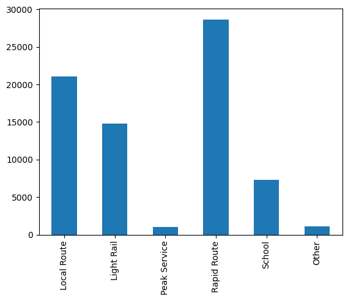
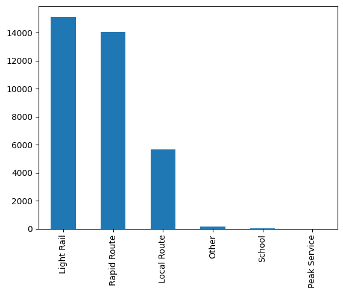

Kovai Co

The given dataset consists of different travel modes taken on different days and we need to predict for the following days.

So in my SARIMAX model, 
 - first data is cleaned and processed and some trends are obtained so that outliers can be minimised.
 - Then we find parameters for SARIMAX model
 - Model is built 
 - Values are forecast 
 - Error is calculated and plotted

Some insights gained are:
Top transport modes on weekdays:

Top transport on weekends:

Top transport on holidays:

Models used are SARIMAX and Prophet Models.
SARIMAX take p,q,r,P,Q,R,m as parameters.

Two models are compared for Peak Services Column and better prediction is obtained with SARIMAX model

